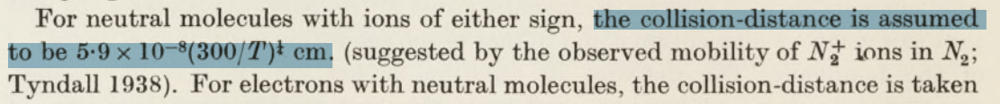
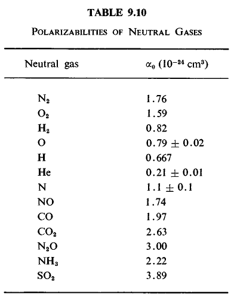
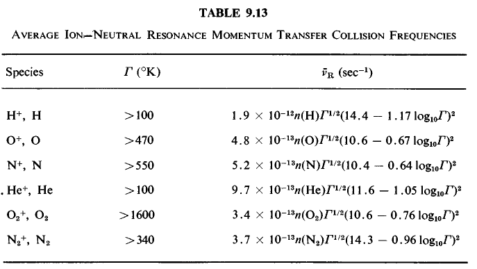
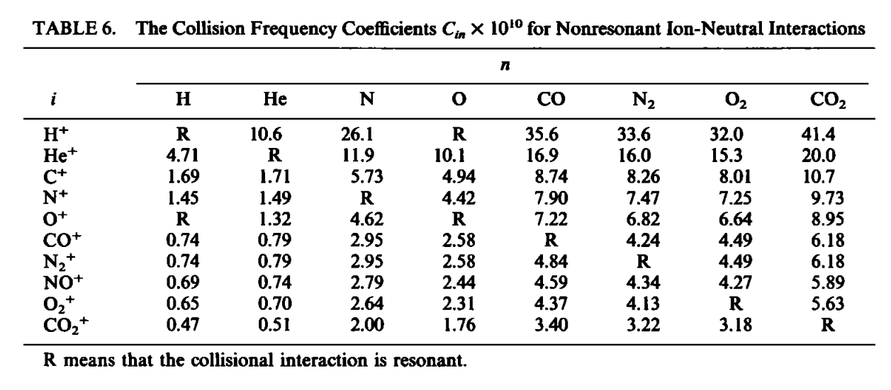
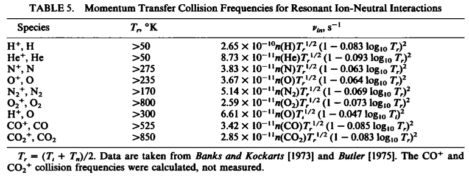
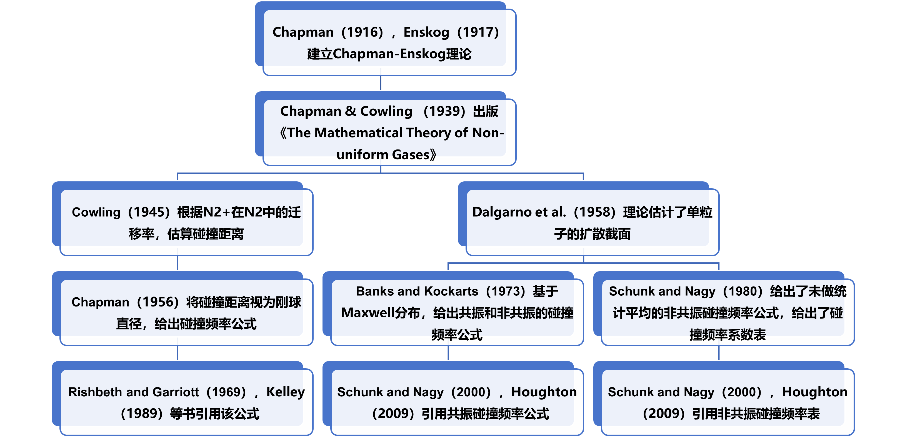
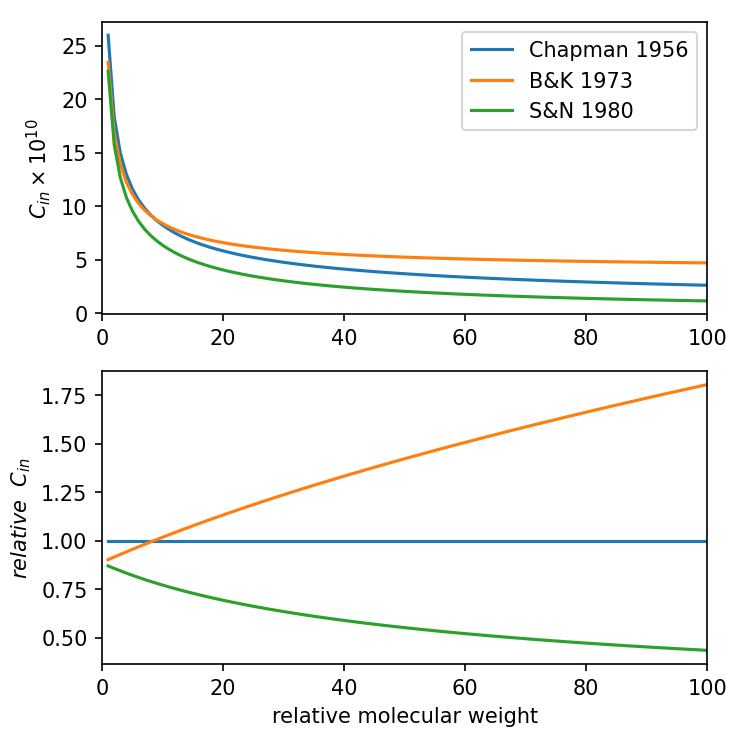

# 电离层中的中性-离子碰撞频率应如何计算？

## 1 基本概念

电离层物理的两大支柱是光化学过程和动力学过程，离子与中性成分碰撞是动力学过程的关键因素之一，它与大气发电机、场向输运、不规则体、垂直风切变均有紧密联系，是热层-电离层耦合过程的立足点，也是电离层建模的基础。在1916和1917年，Chapman与Enskog已经分别建立了离子与中性成分碰撞的数学理论（Chapman and Cowling，1952）。但时至今日，对碰撞频率的概念和计算方法仍多有混淆，不同文献中采用的碰撞频率公式乃至于概念都不一致，因此有必要对碰撞频率的研究历史进行溯源，厘清相关概念，或将对热层-电离层耦合的研究有所裨益。

气体的碰撞频率有两种定义，其一是所有物理学习者都熟知的经典的碰撞频率，即在单位时间内单个离子的碰撞次数。应用气体动理论不难给出碰撞频率公式：

$$
\nu=\sqrt{2}n\sigma \bar v \tag{1}
$$

其中$n$为气体密度，$\sigma$为碰撞截面，$\bar v$为平均速率。该定义可被称为**动理论碰撞频率**。

另一种定义来自于电离层的动量方程，即离子与中性成分通过碰撞传递动量，传递过程的相互作用力依赖于碰撞频率和速度差，按Rishbeth（1969）的写法：

$$
F=nm_i\nu_{in}(V-U) \tag{2}
$$

其中$m_i$为离子质量，$V$为离子速度，$U$为中性成分速度即中性风速。由于作用力等于反作用力，故$\nu_{in}m_i=\nu_{ni}m_n$，即仅在离子与中性成分质量相等时，$\nu_{in}=\nu_{ni}$。该定义被称为**动量传输碰撞频率**/**有效碰撞频率**/**摩擦频率**。

两种方式定义的碰撞频率有所不同，但数量级相近，在文献中也经常混淆，或为简化计算用前者代替后者。有效碰撞频率又取决于速度分布和可能依赖于速度的相互作用力，计算繁复而多变，故难以深究，遇到时注意辨析即可。

## 2 两条路径，三个公式

对碰撞过程的研究可以追溯到爱因斯坦对布朗运动的研究，Einstein–Smoluchowski关系给出了迁移率与扩散系数的关系：

$$
D=\mu k_B T \tag{3}
$$

其中$\mu$为迁移率，即粒子热速度与外力的比值，$k_B$为玻尔兹曼常量，$T$为温度。将有效碰撞频率的定义（公式2）代入该式，可以给出经典的电离层扩散系数公式：

$$
D=\frac{k_B T}{m_i\nu_{in}} \tag{4}
$$

在爱因斯坦研究的基础上，Chapman与Enskog分别在1916和1917年独立建立了非均匀气体的数学理论，并在1939年由Chapman与Cowling整理成书《The Mathematical Theory of Non-uniform Gases》，在1952和1969年出版了第二版和第三版，该书中文版《非均匀气体的数学理论》于1985年出版。

该书基于分子动理论对气体的粘性、热传导、扩散进行了细致的计算，其构建的计算方法被称为Chapman-Enskog理论。但该书仅考虑了动理论的碰撞频率，未直接讨论有效碰撞频率。不过与有效碰撞频率有关的粘滞系数、热传导率、扩散系数是其研究的重点。该书的主要贡献是建立理论框架，并未直接给出可供计算的数值。

碰撞频率的数值计算方法在历史上分为了两条路径，一条路径源自Cowling（1945）的研究，无视了气体种类的差异，基于N2的实验结果确定公式中的系数；另一条路径源自Dalgarno et al. (1958)的研究，根据极化率计算不同气体的碰撞频率系数。

**Cowling（1945）路径**

Cowling（1945）基于Chapman-Enskog理论讨论了太阳大气和地球电离层的电导率，给出离子在中性成分的碰撞距离为$5.9\times 10^{-8}(300/T)^{1/4}cm$，该值是由实验观测给出的$N_2^+$在$N_2$中的迁移率确定的（原文见下图）。

该文虽然也讨论了碰撞频率、电导率的数值，根据离子密度对电离层各层参量做了估计，但并未被之后的研究引用。只有文中提及的碰撞距离，被Chapman（1956）视为离子碰撞截面的直径，用于计算刚性球体假设下的碰撞频率，给出了目前最泛用的碰撞频率公式：

$$
\nu_{in}=2.6\times 10^{-9}(n_i+n_n)W^{-1/2} \tag{5}
$$

该公式的广泛应用离不开Rishbeth and Garriott（1969）和Kelley（1989）对该公式的引用。Rishbeth and Garriott（1969）将$(n_i+n_n)$改为$n$，由于电离层中性成分密度远大于离子密度，结果相差不大。该书同时提及公式2中的质量有些作者使用了约化质量$\mu=m_am_b/(m_a+m_b)$，与动理论的定义更接近。如果离子与分子质量相同，将使碰撞频率翻倍，如果质量差异更大，影响也更大。

**Dalgarno et al.（1958）路径**

Dalgarno et al.（1958）基于Chapman-Enskog理论讨论了离子的迁移率，其主要贡献是给出了扩散界面的估计。理论定义下的扩散截面为

$$
Q_d=2\pi\int_0^\pi I(\theta)(1-\cos{\theta})\sin{\theta}d\theta \tag{6}
$$

在高温下，扩散截面被数值估计为：

$$
Q_d=2.210\pi q^2 \tag{7}
$$

其中q取决于分子间势能的变化参数，较为复杂，Dalgarno et al.（1958）没有直接给出其数值，也未提及碰撞频率，而仅讨论了迁移率、扩散系数、粘滞系数等参量。

Banks and Kockarts（1973）借鉴了该结果，认为单粒子的动量传输截面为：

$$
q_d=2.21\pi (\alpha e^2/\mu g^2)^{1/2} \tag{8}
$$

其中$\alpha$为气体原子的极化率，$\mu$为约化质量，$e$为电子电荷量，$g$为相对速度。基于麦克斯韦速度分布做理论推导，平均动量传输截面为：

$$
\overline{Q_D}=(3\sqrt{2}/16){\pi}^{3/2}(4.88\alpha e^2/\mu)^{1/2}[(kT_i/m_i)+(kT_n/m_n)]^{-1/2} \tag{9}
$$

同时修正后的平均碰撞频率公式为：

$$
\overline{\nu}_{12}=\frac{4}{3}n_2v_{12}\overline{Q_D} \tag{10}
$$

用平均相对速度$v_{12}$可以消去$\overline{Q_D}$中的温度项，使结果大大简化为

$$
\overline{\nu}_{in}=2.6\times 10^{-9}n_n(\alpha_0/\mu_A)^{1/2} sec^{-1} \tag{11}
$$

该公式完全来自于理论推理，但结果与基于实验参数的公式5非常相似，且系数2.6从第三位开始才有差异。但该公式多出了极化率，将离子质量替换为约化质量，即中性成分的种类也对碰撞频率有影响，这和公式5完全不同。Banks and Kockarts（1973）给出了不同气体分子的极化率（静电单位制），但并未对碰撞频率做进一步计算。

公式11仅考虑了离子在非同类中性成分中的碰撞频率，此时相互作用以分子极化为主，属非共振碰撞。离子在同类中性成分中的相互作用以电荷交换为主，属共振碰撞，其理论更加复杂，结果也依赖于温度。 Banks and Kockarts（1973）首次给出了H/O/N/He/O2/N2六种分子的共振碰撞频率，如下表所示：

Schunk and Nagy（1980）同样从Dalgarno et al.（1958）给出的公式7出发，但给出了不同于Banks and Kockarts（1973）的碰撞频率形式：

$$
\nu_{in}=2.21\pi \frac{n_n m_n}{m_i+m_n}(\frac{\eta_n e^2}{\mu_{in}})^{1/2}=C_{in}n_n \tag{12}
$$

其中$\eta_n$为极化率，$\mu_{in}$为约化质量。该公式似乎直接应用了单粒子的碰撞截面和动理论的碰撞频率定义，即忽略了离子在麦克斯韦分布下求平均时的系数，而Banks and Kockarts（1973）的结果考虑了这一点。

Schunk and Nagy（1980）利用公式12给出了$C_{in}$的系数表：

Schunk and Nagy（2000）与Houghton（2009）均引用了此表，并成为后续诸多论文的引用来源。

对于共振碰撞，Schunk and Nagy（1980）相对于Banks and Kockarts（1973）增加了三种共振碰撞的频率：

## 3 总结

离子与中性成分的碰撞频率的研究历史，可以总结如下图。在一百多年的研究过程中，形成了四套常用的计算公式，

- Chapman（1956）给出的公式5，该公式的系数基于实验结果，不区分共振碰撞与非共振碰撞。
- Banks and Kockarts（1973）给出的公式11，该公式适用极化作用为主的非共振碰撞频率。
- Schunk and Nagy（1980）给出的公式12，以及根据公式计算的碰撞频率系数表，仅适用于非共振碰撞。
- Schunk and Nagy（1980）给出的共振碰撞频率公式表，应用与电荷交换为主的共振碰撞。

若假设中性成分以O为主，忽略共振碰撞，可以分别计算三套公式给出的碰撞频率系数，它们与相对分子量的关系如下图所示：

三个公式给出了相似的结果，当相对分子量小于8时（H+/He+），Banks and Kockarts（1973）和Schunk and Nagy（1980）给出的结果基本相同，Chapman（1956）给出的结果略大。当相对分子量大于8时，Banks and Kockarts（1973）给出的碰撞频率大于Chapman（1956），又大于Schunk and Nagy（1980），且相对分子量越大，三者相差越大。相对分子量为92时，三者之比约1:1.75:0.45。

对于常见的O+，NO+等离子，其分子量小于40，公式计算的差异在两倍以内，较重的铁离子（56）差异约2.76倍。根据碰撞频率公式，碰撞频率系数的差异可用中性成分密度的差异替代，而中性成分的密度随高度指数变化，因此对较轻的离子，选择不同的公式将导致不超过0.7个标高的差异，对铁离子则意味着略大于一个标高的差异，对研究来说并非可以忽略的影响。

然而三种公式本质上都是理论公式，并无实验结果予以验证，唯一的实验数据N2+在N2中的扩散应采用电荷交换的共振碰撞频率公式，却被Chapman（1956）应用于刚球碰撞公式，风马牛不相及。因此也无从得知到底哪个公式更为准确。从中庸的角度讲，或许用取值处于中间的Chapman（1956）的公式最好，但它的理论最粗糙，实在令人难以抉择。

## 4 参考文献

[^1]: V.C.A.F. (1954). The Mathematical Theory of Non-uniform Gases. An account of the kinetic theory of viscosity, thermal conduction, and diffusion in gases. By Sydney Chapman and T. G. Cowling. 2nd Edn., pp. ix, 431. 60s. 1952. (Cambridge University Press). The Mathematical Gazette, 38(323), 63–64. doi:10.2307/3609795

[^2]: Cowling, T.G. (1945). The electrical conductivity of an ionized gas in a magnetic field, with applications to the solar atmosphere and the ionosphere. Proceedings of the Royal Society of London. Series A. Mathematical and Physical Sciences, 183, 453 - 479.

[^3]: Chapman (1956) The Electrical Conductivity of the Ionosphere: a Review.

[^4]: Dalgarno, A., Mcdowell, M.R., & Williams, A.F. (1958). The mobilities of ions in unlike gases. Philosophical Transactions of the Royal Society of London. Series A, Mathematical and Physical Sciences, 250, 411 - 425.

[^5]: Rishbeth, H., & Garriott, O.K. (1969). Introduction to ionospheric physics.

[^6]: Schunk, R. W., and A. F. Nagy (1980), Ionospheres of the terrestrial planets, Rev. Geophys., 18(4), 813–852, doi:10.1029/RG018i004p00813.

[^7]: Kelley, M. C. (1989), The Earth's Ionosphere, Int. Geophys. Ser., vol. 43, Elsevier, New York.

[^8]: Schunk, R.W., & Nagy, A.F. (2000). Ionospheres : physics, plasma physics, and chemistry.

[^9]: Houghton（2009）Ionospheres：Physics, Plasma Physics, and Chemistry
